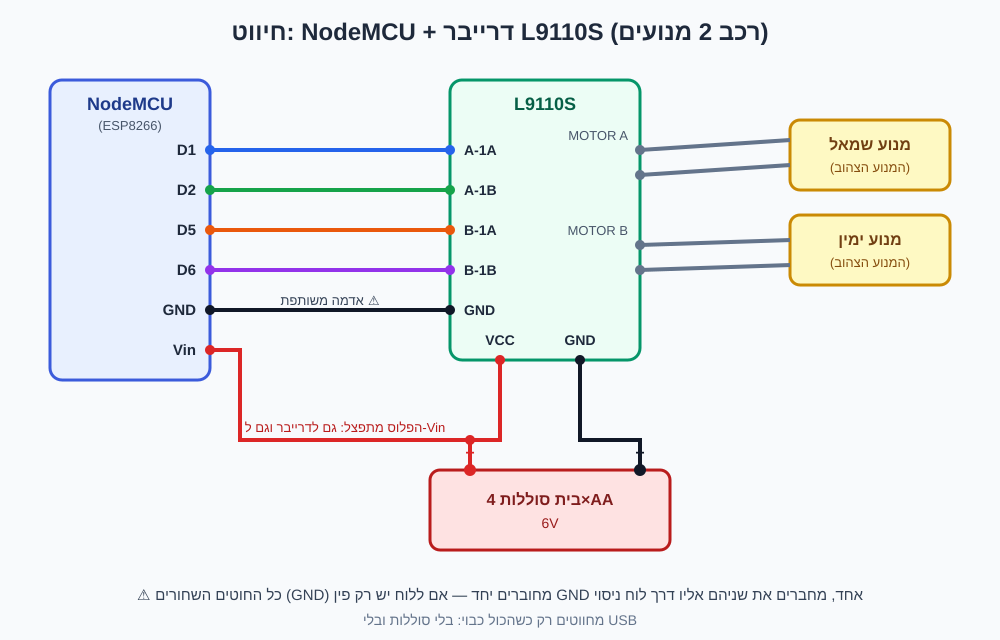
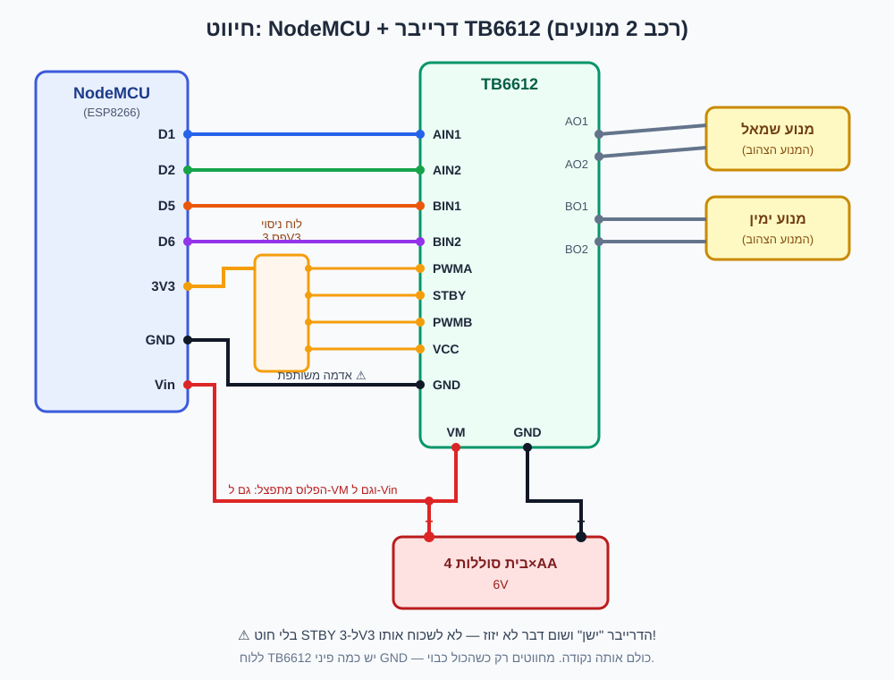

# 🚗 רכב טוטו — רכב אלחוטי בשליטת WiFi

רכב 2 מנועים שנשלט מהטלפון דרך WiFi — **בלי כבל USB, בלי ראוטר, בלי אינטרנט**.
הלוח (NodeMCU) מקים רשת WiFi משלו, מתחברים אליה מהטלפון ונוהגים עם ג'ויסטיק מגע.

> כבל ה-USB משמש **רק פעם אחת** — כדי להעלות את הקוד ללוח.
> אחרי זה מנתקים אותו לתמיד והכול עובד על סוללות.

---

## 🧰 מה צריך

| פריט | הערה |
|------|------|
| NodeMCU (ESP8266) | הלוח עם ה-WiFi — יש לך ✔ |
| דרייבר מנועים L9110S **או** TB6612 | יש לך ✔ (הקוד עובד עם שניהם) |
| שלדת 2WD עם 2 מנועים צהובים | יש לך ✔ |
| בית סוללות 4×AA (6V) עם חוטים | מקור הכוח של הרכב |
| 4 סוללות AA | עדיף אלקליין טובות — מנועים אוכלים הרבה |
| חוטי חיבור (ג'אמפרים) נקבה-נקבה + זכר-נקבה | בערך 10 חוטים |
| לוח ניסוי קטן (breadboard) | לא חובה ל-L9110S, **כן צריך ל-TB6612** |
| כבל Micro-USB | רק להעלאת הקוד מהמחשב |

---

## 🧠 איך זה עובד (בפשטות)

```
   הטלפון שלך                NodeMCU                 דרייבר              מנועים
  ┌───────────┐   WiFi    ┌───────────┐   חוטים   ┌─────────┐  חוטים  ┌────────┐
  │ ג'ויסטיק  │ ────────► │ המוח:     │ ────────► │ השרירים │ ──────► │ גלגלים │
  │ בדפדפן    │           │ מקבל      │           │ מגבירים │         │        │
  └───────────┘           │ פקודות    │           │ את הזרם │         └────────┘
                          └───────────┘           └─────────┘
                                ▲                      ▲
                                └──── סוללות 6V ───────┘
```

למה צריך דרייבר? כי ה-NodeMCU חכם אבל חלש — הפינים שלו לא יכולים לספק
מספיק זרם לסובב מנוע. הדרייבר מקבל ממנו פקודות חלשות והופך אותן לזרם חזק מהסוללות.

---

## 🔌 שלב 1: חיווט

### ⚠️ שלושה כללי זהב לפני שמתחילים

1. **מחווטים רק כשהכול כבוי** — בלי סוללות ובלי USB.
2. **אדמה משותפת (GND)**: המינוס של הסוללות, ה-GND של הדרייבר וה-GND של ה-NodeMCU — **חייבים להיות מחוברים יחד**. זו התקלה מספר 1 של מתחילים.
3. **אסור לחבר מנוע ישירות ל-NodeMCU** — רק דרך הדרייבר.

---

### אם יש לך L9110S (הלוח הקטן עם 2 שקעי מנוע)



| מ־NodeMCU | אל L9110S | תפקיד |
|-----------|-----------|-------|
| D1 | A-1A | מנוע שמאל — קדימה |
| D2 | A-1B | מנוע שמאל — אחורה |
| D5 | B-1A | מנוע ימין — קדימה |
| D6 | B-1B | מנוע ימין — אחורה |
| GND | GND | אדמה משותפת ⚠ |

| מ־בית הסוללות | אל | תפקיד |
|---------------|-----|-------|
| חוט אדום (+) | VCC בדרייבר **וגם** Vin ב-NodeMCU | חשמל לכולם |
| חוט שחור (−) | GND בדרייבר | אדמה |

| מנועים | אל |
|--------|-----|
| מנוע שמאל (2 חוטים) | בורג MOTOR A |
| מנוע ימין (2 חוטים) | בורג MOTOR B |

> חוט אדום אחד מהסוללות צריך להגיע לשני מקומות (דרייבר + NodeMCU).
> אפשר לפצל עם לוח ניסוי, או לחבר את חוט הסוללה לדרייבר ולמשוך ממנו חוט נוסף ל-Vin.

---

### אם יש לך TB6612 (הלוח הקטן עם הרבה פינים)



| מ־NodeMCU | אל TB6612 | תפקיד |
|-----------|-----------|-------|
| D1 | AIN1 | מנוע שמאל — קדימה |
| D2 | AIN2 | מנוע שמאל — אחורה |
| D5 | BIN1 | מנוע ימין — קדימה |
| D6 | BIN2 | מנוע ימין — אחורה |
| 3V3 | VCC | חשמל למוח של הדרייבר |
| 3V3 | PWMA | תמיד דלוק (דרך לוח הניסוי) |
| 3V3 | PWMB | תמיד דלוק (דרך לוח הניסוי) |
| 3V3 | STBY | "תתעורר" — בלעדיו הדרייבר ישן! |
| GND | GND | אדמה משותפת ⚠ |

> ל-NodeMCU אין 4 פיני 3V3 — לכן לוקחים חוט אחד מ-3V3 אל שורה בלוח הניסוי,
> ומשם 4 חוטים קצרים אל VCC, PWMA, PWMB, STBY.

| מ־בית הסוללות | אל | תפקיד |
|---------------|-----|-------|
| חוט אדום (+) | VM בדרייבר **וגם** Vin ב-NodeMCU | כוח למנועים וללוח |
| חוט שחור (−) | GND בדרייבר | אדמה |

| מנועים | אל |
|--------|-----|
| מנוע שמאל | AO1 + AO2 |
| מנוע ימין | BO1 + BO2 |

---

## 💻 שלב 2: העלאת הקוד (פעם אחת עם USB)

1. **מתקינים את Arduino IDE** מהאתר: https://www.arduino.cc/en/software (גרסה 2).
2. **מלמדים אותו להכיר את הלוח שלנו:**
   - פותחים `File ‹ Preferences`
   - בשדה **Additional Boards Manager URLs** מדביקים:
     ```
     http://arduino.esp8266.com/stable/package_esp8266com_index.json
     ```
   - `Tools ‹ Board ‹ Boards Manager` → מחפשים **esp8266** → לוחצים **Install** (לוקח כמה דקות).
3. **בוחרים את הלוח:** `Tools ‹ Board ‹ esp8266 ‹ NodeMCU 1.0 (ESP-12E Module)`
4. **מחברים את ה-NodeMCU למחשב ב-USB** ובוחרים את הפורט: `Tools ‹ Port` (בדרך כלל יופיע COM חדש).
   - אם לא מופיע פורט — צריך להתקין דרייבר CH340 (חיפוש בגוגל: "CH340 driver", התקנה של דקה).
5. **פותחים את הקובץ** `tutu_car/tutu_car.ino` ולוחצים על כפתור החץ (⭢ Upload).
6. כשכתוב **Done uploading** — סיימנו! מנתקים את ה-USB.

---

## 🎮 שלב 3: נוהגים!

1. שמים את הרכב על הרצפה (או מרימים גלגלים באוויר לבדיקה ראשונה).
2. מכניסים סוללות — נורה קטנה תידלק על הלוח.
3. בטלפון: `הגדרות ‹ WiFi` → מתחברים לרשת **TUTU-CAR** (סיסמה: `12345678`).
   - הטלפון יגיד "אין אינטרנט" — זה בסדר, לא צריך אינטרנט. אם ישאל "להישאר מחובר?" — כן.
4. פותחים דפדפן וגולשים אל: **http://192.168.4.1**
5. גוררים את הג'ויסטיק הכחול — הרכב נוסע! 🎉
   - הנקודה הירוקה למעלה = יש קשר. אדומה = הקשר נפל.
   - המחוון למטה מגביל את המהירות המרבית.
   - עוזבים את הג'ויסטיק (או לוחצים "עצור הכל") — הרכב עוצר.

**בטיחות מובנית:** אם ה-WiFi מתנתק פתאום — הרכב עוצר לבד תוך חצי שנייה.

---

## 🔧 משהו לא עובד?

| הבעיה | הפתרון |
|--------|--------|
| מנוע מסתובב הפוך (קדימה=אחורה) | לא מחליפים חוטים! בקוד למעלה משנים `L_REVERSED` או `R_REVERSED` ל-`true` ומעלים שוב |
| הרכב פונה כשהוא אמור לנסוע ישר | המנועים התחלפו בין צדדים — מחליפים בין החיבורים של מנוע A ומנוע B בדרייבר |
| שום דבר לא זז אבל הדף עובד | 90% שזו האדמה המשותפת — לבדוק שחוט GND מחבר בין NodeMCU לדרייבר |
| TB6612: כלום לא זז | לבדוק ש-STBY מחובר ל-3V3 — בלעדיו הדרייבר "ישן" |
| הרכב חלש / זז רק במהירות גבוהה | סוללות חלשות (הכי נפוץ), או להעלות את `MIN_PWM` בקוד ל-90 |
| רשת TUTU-CAR לא מופיעה בטלפון | לבדוק שהנורה על ה-NodeMCU דולקת; להמתין 10 שניות אחרי הדלקה; לרענן את רשימת הרשתות |
| הדף לא נטען | לוודא שהטלפון באמת מחובר ל-TUTU-CAR (ולא חזר לרשת הביתית), ואז שוב 192.168.4.1 |
| הלוח מתאתחל כשהמנועים עובדים | הסוללות צונחות במתח — סוללות טריות, או בית סוללות של 6 סוללות במקום 4 |

---

## 📁 מה יש בתיקייה

```
arduino-car/
├── README.md              ← המדריך הזה
├── tutu_car/
│   └── tutu_car.ino       ← כל הקוד (פותחים ב-Arduino IDE)
├── wiring-l9110s.svg      ← תרשים חיווט ל-L9110S
└── wiring-tb6612.svg      ← תרשים חיווט ל-TB6612
```

## 🎛 דברים שכיף לשנות בקוד

בראש הקובץ `tutu_car.ino` יש אזור "הגדרות":

- `AP_SSID` / `AP_PASS` — שם רשת ה-WiFi והסיסמה
- `L_REVERSED` / `R_REVERSED` — היפוך כיוון מנוע בלי להחליף חוטים
- `MIN_PWM` — כמה כוח מינימלי לתת למנוע
- `FAILSAFE_MS` — תוך כמה זמן בלי קשר הרכב עוצר
